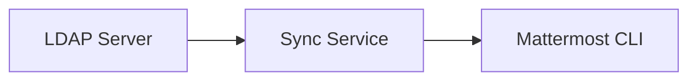

# 🔄 Mattermost LDAP Group Sync


Сервис для автоматической синхронизации LDAP-групп с Mattermost через API.

## 🌟 Основные возможности

| 🛠 Функционал          | 📝 Описание |
|-----------------------|------------|
| **LDAP Integration**  | Получение актуального списка групп и состава пользователей из LDAP |
| **Mattermost API**    | Управление группами и членством через Mattermost API |
| **Smart Sync**        | Сравнение данных и точечное применение изменений |
| **Error Tracking**    | Интеграция с Sentry для мониторинга ошибок |

## 📊 Архитектура решения


## 🚀 Как использовать
Замените имя-команды или имя-канала на фактические значения.

1. Синхронизация команд (Team)
Запуск синхронизации всех команд:

```bash
python command.py sync-team
```
Синхронизация конкретной команды:

```bash
python command.py sync-team --team-name "имя-команды"
```
2. Синхронизация каналов (Channel)
Синхронизация всех каналов:

```bash
python command.py sync-channels
```
Синхронизация конкретного канала:

```bash
python command.py sync-channels --channel-name "имя-канала"
```
🧪 Тестовый режим (Dry Run)
Для проверки изменений без фактического применения (имитация) добавьте флаг `--dry-run`:

**Для команды** - `python command.py sync-team --team-name "имя-команды" --dry-run`
**Для канала** - `python command.py sync-channels --channel-name "имя-канала" --dry-run`

* Примечание: Скрипт автоматически выявит отсутствующих пользователей и добавит их, а также удалит неактивных участников в соответствии с данными LDAP.


